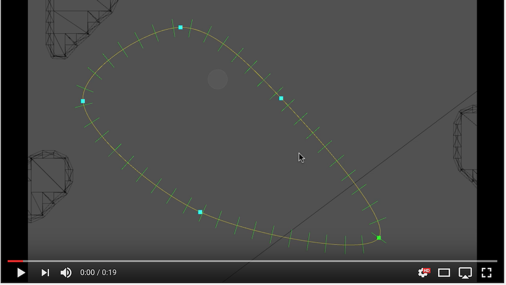

# Unity Spline2D

Unity Spline2D is a free 2D simple spline library for Unity. 

## Features

* **Easy to use**: define a series of intersection points and that's it. The spline
  will pass through those points with a default Catmull-Rom curvature. No
  need to set tangent control points.
* **Positions and Derivatives**: get both a position on the curve and its 
  derivative (to get facing)
* **Interpolate by Distance**: interpolating by `t` alone can result in varied
  speeds along the curve if your points are not equidistant. With Spline2D you
  can ask for a position a specific distance along the curve instead, and therefore
  traverse the curve at a known speed regardless of the structure of the curve.
* **Tweakable curvature**: if you want something other than Catmull-Rom style
  curves, you can increase/decrease the `Curvature` property to change the shape
* **Optimised for 2D**: always flat, defaults to X/Y like 2D mode in Unity 
  but can be switched to display/edit in X/Z for use with 3D floor planes

## Installation
* Place `Spline2D.cs` and `Spline2DComponent.cs` anywhere you like
* Place `Spline2DInspector.cs` in an `Editor` subfolder somewhere.

## Usage: 

* To just use splines from general code, instantiate `Spline2D` and call its
  AddPoint methods etc to build the spline
* To use a spline in a scene & save it, use `Spline2DComponent` as a regular
  Unity component. There is a inspector with buttons to add/remove points, and
  you can select points and drag them around to change the curve.

## License

The MIT License (MIT)

Copyright (c) 2016-2019 Steve Streeting

Permission is hereby granted, free of charge, to any person obtaining a copy
of this software and associated documentation files (the "Software"), to deal
in the Software without restriction, including without limitation the rights
to use, copy, modify, merge, publish, distribute, sublicense, and/or sell
copies of the Software, and to permit persons to whom the Software is
furnished to do so, subject to the following conditions:

The above copyright notice and this permission notice shall be included in all
copies or substantial portions of the Software.

THE SOFTWARE IS PROVIDED "AS IS", WITHOUT WARRANTY OF ANY KIND, EXPRESS OR
IMPLIED, INCLUDING BUT NOT LIMITED TO THE WARRANTIES OF MERCHANTABILITY,
FITNESS FOR A PARTICULAR PURPOSE AND NONINFRINGEMENT. IN NO EVENT SHALL THE
AUTHORS OR COPYRIGHT HOLDERS BE LIABLE FOR ANY CLAIM, DAMAGES OR OTHER
LIABILITY, WHETHER IN AN ACTION OF CONTRACT, TORT OR OTHERWISE, ARISING FROM,
OUT OF OR IN CONNECTION WITH THE SOFTWARE OR THE USE OR OTHER DEALINGS IN THE
SOFTWARE.

## Notes
* Tested in Unity 5.4 - 2018
* Pull requests welcome!

[Spline2D]: https://github.com/sinbad/UnitySpline2D
